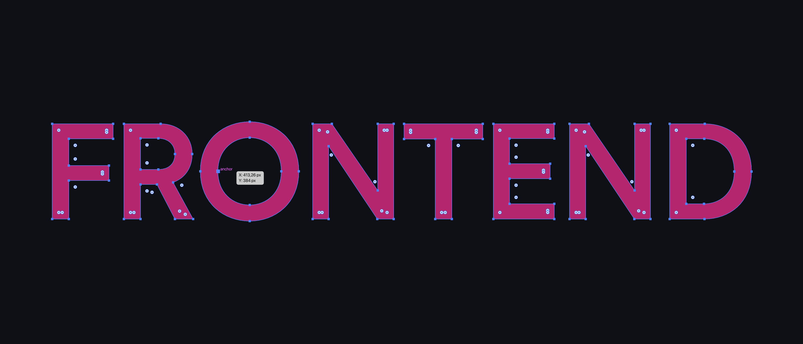

### 💫 About Me

Hi, I’m Steven, a software engineer focusing mainly on the frontend stack of web technologies. Currently, I’m working at the Max Planck Institute for Evolutionary Anthropology in the department of [Comparative Cultural Psychology](https://www.eva.mpg.de/comparative-cultural-psychology/index/). I am helping PhD students and PostDocs with their projects. You can check out some of the projects here: https://github.com/ccp-eva

### 💻 Tech Stack
I love JavaScript and, more recently, TypeScript, React-based frameworks (e.g., Next.js), discussions about CSS in JS (Tailwind is the future), Tabs vs Spaces ([Tabs will win](https://github.com/prettier/prettier/issues/7475)), and Semicolons (indifferent ¯\\(ツ)/¯). I love designing (I made the logo for [FlowLauncher](https://github.com/Flow-Launcher/Flow.Launcher)) and a great UX, browser animations (SVG ❤️), and Typography ❦

### 🏗️ Current Projects

I created a novel approach how to design browser-based experiments using a single SVG file (this allows experimenters to draft their studies in a vector app (e.g., Illustrator, Inkscape):
- Demo/Code: https://github.com/ccp-eva/gafo-demo
- Preprint: https://psyarxiv.com/vghw8

For various projects, I work with eye-tracking raw data. Therefore I created an R package to automize common eyetracking
- Code: https://github.com/ccp-eva/eyewit
- Paper: TBA

I love the Arduino platform. For a project, we needed a custom-made dispenser that releases plastic beads upong correct responses.
- Code and Demo: https://github.com/ccp-eva/bead-dispenser
- BTW: Arduino & WebUSB is awesome: https://github.com/kalaschnik/webusb-stepper-motor
